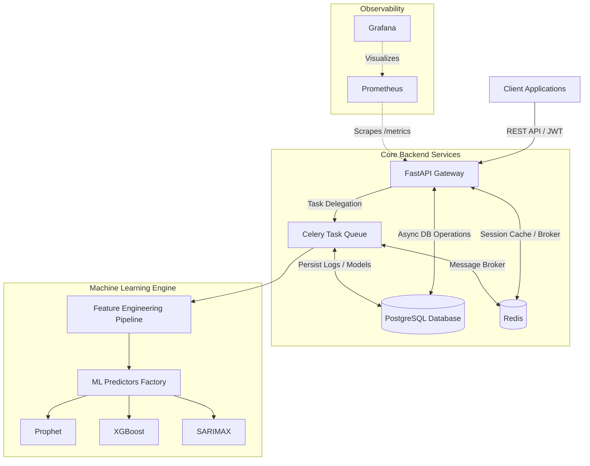

# Demand Forecasting System

An enterprise-grade, highly scalable platform for time-series demand forecasting using statistical modeling and machine learning pipelines. 

## System Architecture

The application is built on a microservices-inspired architecture designed to handle heavy ML workloads without blocking the main API gateway.



### Key Components

1. **FastAPI Gateway**: Serves as the primary entry point for all client requests. It handles JWT authentication, routing, and ensures non-blocking I/O operations through asynchronous execution.
2. **PostgreSQL**: The relational database for storing users, model metadata, feature registries, predictions, and analytics metrics. Connected via the `asyncpg` driver.
3. **Redis**: Acts as the message broker for Celery and as an in-memory cache for high-frequency queries.
4. **Celery Task Queue**: ML training and inference are CPU-bound and synchronous. Celery seamlessly offloads these tasks to background workers, protecting the API event loop from crashing under load.
5. **Feature Engineering Pipeline**: Organically generates lag features, rolling statistics, and temporal encodings to capture non-linear trends.
6. **Machine Learning Engine**: Implements a uniform predictor interface for easily swapping out algorithms (`Prophet`, `XGBoost`, `Statsmodels/SARIMAX`).
7. **Observability Stack**: Prometheus aggregates operational metrics (latency, queue depths, model drift), and Grafana provides real-time dashboards.

## Quick Start

### 1. Environment Setup

Copy the example environment variables:
```bash
cp .env.example .env
```

### 2. Launching the Infrastructure

The entire platform is containerized. Start it using Docker Compose:
```bash
docker-compose up --build
```

This command will spin up:
- The FastAPI Backend (`http://localhost:8000`)
- OpenAPI Documentation (`http://localhost:8000/docs`)
- The Celery Worker
- PostgreSQL Database
- Redis
- Prometheus (`http://localhost:9090`)
- Grafana (`http://localhost:3000`)

### 3. Database Migrations

Apply the initial schema:
```bash
docker-compose exec backend alembic upgrade head
```

## Running Tests

To run the automated test suite locally:
```bash
pytest tests/
```